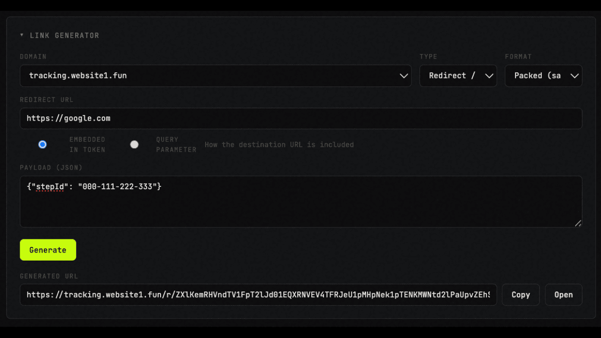

# Custom Domain Tracking



A Cloudflare Workers-based system that lets your users track email opens and link clicks through their own custom domains, improving deliverability, branding, and domain reputation.

## What It Does

When you send emails on behalf of your users, tracking links typically point to your shared domain. This system lets each user bring their own domain (e.g., `track.theirdomain.com`) for tracking pixels and click redirects, all managed automatically via Cloudflare for SaaS.

**How it works:**

1. Your backend calls the SDK to register a user's custom domain
2. The user adds a single CNAME record
3. Cloudflare provisions SSL and routes traffic automatically
4. The Worker handles tracking hits (`/t/:id` for opens, `/r/:id` for clicks) and sends webhook events to your backend

## Features

- **Custom domain management** — Create, verify, and delete custom hostnames via a simple TypeScript SDK
- **Automatic SSL** — Cloudflare provisions and renews certificates for every custom hostname
- **Email open tracking** — 1x1 transparent pixel served from the user's domain
- **Link click tracking** — Redirect-based click tracking with signed URLs
- **Signed tracking tokens** — HMAC-signed payloads prevent forgery and cross-domain reuse
- **Webhook delivery** — Real-time events for opens, clicks, domain verification, and failures with HMAC signature verification
- **Dead letter queue** — Optional fallback URL for failed webhook deliveries
- **Automated domain verification** — Cron job checks domain status every 5 minutes and sends lifecycle webhooks (`domain.verified`, `domain.failed`, `domain.disconnected`)
- **Rate limiting** — Optional, with KV (default) or Redis backends
- **Zero external dependencies** — Runs entirely on Cloudflare Workers + KV

## Who Should Use This

This system is built for **SaaS platforms and email service providers** that:

- Send emails on behalf of their users (marketing platforms, CRMs, transactional email services)
- Want to offer white-label / custom domain tracking to their customers
- Need reliable open and click tracking with webhook-based event delivery
- Are already on or willing to use Cloudflare

## Quick Start

Installation and deployment takes just a few minutes:

```bash
# 1. Clone and install
git clone <repo-url> && cd custom-domain-tracking
npm install

# 2. Create KV namespace
npx wrangler kv namespace create SUBDOMAINS

# 3. Configure secrets
# Add your secrets to .dev.vars, then:
npm run setup-secrets

# 4. Deploy
npm run deploy
```

## SDK Usage

```typescript
import { createSDK } from "./src/sdk/index.js";

const sdk = createSDK({
  cfApiToken: env.CF_API_TOKEN,
  cfZoneId: env.CF_ZONE_ID,
  webhookUrl: env.WEBHOOK_URL,
  kvNamespace: env.SUBDOMAINS,
  signingSecret: env.TRACKING_SIGN_KEY,
});

// Register a user's custom domain
await sdk.createSubdomain({ hostname: "track.theirdomain.com" });

// Generate a signed tracking pixel
const trackingId = await sdk.generateTrackingId(
  "track.theirdomain.com",
  { emailId: "email-123", userId: "user-456" },
);
const pixel = ``;

// Generate a signed click-tracking link
const linkId = await sdk.generateTrackingId(
  "track.theirdomain.com",
  { linkId: "link-789", url: "https://example.com/pricing" },
);
const trackedUrl = `https://track.theirdomain.com/r/${linkId}`;
```

## Guides

- **[Integrator Guide](docs/guide-integrator.md)** — Full setup instructions: Cloudflare configuration, Worker deployment, SDK integration, webhook handling, and production checklist
- **[User Guide](docs/guide-user.md)** — Instructions for end users setting up their custom tracking domain

## Commands

```bash
npm run dev          # Local development with wrangler
npm run deploy       # Deploy to Cloudflare Workers
npm run typecheck    # Type checking with tsc
npm run setup-secrets # Push secrets from .dev.vars to Cloudflare
```

## Architecture

| Component | Path | Description |
|-----------|------|-------------|
| SDK | `src/sdk/` | TypeScript library for managing custom hostnames and generating signed tracking tokens |
| Worker | `src/worker/` | Cloudflare Worker handling tracking routes and cron-based domain verification |
| Types | `src/types/` | Shared type definitions |
